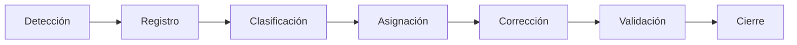

4.5 Manual de Seguridad


<!-- 
- Descripción del modelo de amenazas 
- Herramientas de seguridad integradas y su configuración
- Interpretación de reportes generados (Trivy, ZAP, Gitleaks, Bandit)
- Proceso de gestión de vulnerabilidades encontradas
- Política de divulgación responsable (responsible disclosure)
 --> 

# 🔐 Manual de Seguridad

## VulnCentral – Plataforma DevSecOps para Gestión de Vulnerabilidades

---

## 1. 🛡️ Descripción del modelo de amenazas

El modelo de amenazas de VulnCentral se basa en identificar **activos críticos, actores, vectores de ataque y controles de mitigación**.

---

### 🎯 Activos críticos

* API Gateway (FastAPI)
* Base de datos PostgreSQL
* Sistema de colas (RabbitMQ)
* Worker Celery
* Frontend (React)
* Archivos de reportes (Trivy JSON)

---

### 👤 Actores de amenaza

| Tipo              | Descripción                                |
| ----------------- | ------------------------------------------ |
| Usuario malicioso | Usuario autenticado con intención de abuso |
| Atacante externo  | Sin acceso previo al sistema               |
| Insider           | Usuario con privilegios elevados           |

---

### ⚠️ Principales amenazas

| Categoría     | Riesgo                            |
| ------------- | --------------------------------- |
| Autenticación | Robo de JWT                       |
| Autorización  | IDOR (acceso indebido a recursos) |
| Inyección     | SQL Injection                     |
| XSS           | Inyección en frontend             |
| Exposición    | Fugas de datos sensibles          |
| DoS           | Sobrecarga del API                |
| Archivos      | Path Traversal                    |

---

### 🧱 Controles implementados

* 🔐 Autenticación con JWT
* 🛂 RBAC (control de acceso por roles)
* 🚫 Validación de entrada (Pydantic)
* 🧼 Sanitización de datos (`html.escape`)
* 📏 Límite de tamaño de payload
* 🚦 Rate limiting
* 📜 Auditoría (audit_logs)
* 📁 Validación de rutas seguras

---

## 2. 🧰 Herramientas de seguridad integradas y su configuración

VulnCentral integra herramientas DevSecOps en su pipeline:

---

### 🔍 1. Trivy (Escaneo de vulnerabilidades)

**Uso:** análisis de contenedores y dependencias

#### Configuración básica

```bash
trivy image nginx:latest
```

#### Integración con VulnCentral

* Se envía JSON al endpoint:

```bash
POST /api/v1/scans/{scan_id}/trivy-report
```

* Variable importante:

```bash
MAX_JSON_BODY_BYTES=10485760
```

---

### 🌐 2. OWASP ZAP (DAST)

**Uso:** pruebas dinámicas de seguridad

#### Ejecución básica

```bash
zap-baseline.py -t http://localhost:8080
```

#### Recomendaciones

* Ejecutar en CI/CD
* Analizar endpoints del API y frontend

---

### 🔐 3. Gitleaks (detección de secretos)

**Uso:** evitar exposición de credenciales

```bash
gitleaks detect --source .
```

---

### 🐍 4. Bandit (SAST para Python)

**Uso:** detectar vulnerabilidades en código Python

```bash
bandit -r services/api-gateway
```

---

### ⚙️ Configuración recomendada en CI/CD

Ejemplo flujo:

```text
Gitleaks → Bandit → Trivy → ZAP → Deploy
```

---

## 3. 📊 Interpretación de reportes generados

---

### 🧪 Trivy

#### Campos importantes

| Campo           | Significado            |
| --------------- | ---------------------- |
| VulnerabilityID | CVE                    |
| Severity        | CRITICAL, HIGH, MEDIUM |
| Title           | Descripción            |
| Package         | Librería afectada      |

#### Prioridad

* 🔴 CRITICAL → inmediata
* 🟠 HIGH → alta
* 🟡 MEDIUM → planificada

---

### 🌐 ZAP

#### Tipos de alertas

| Nivel  | Acción           |
| ------ | ---------------- |
| High   | Corregir urgente |
| Medium | Evaluar          |
| Low    | Monitorear       |

---

### 🔐 Gitleaks

Ejemplo:

```text
AWS_SECRET_KEY detected
```

✔ Acción:

* Rotar credenciales
* Eliminar del repositorio

---

### 🐍 Bandit

Ejemplo:

```text
Use of hardcoded password
```

✔ Acción:

* Reemplazar por variables de entorno

---

## 4. 🔄 Proceso de gestión de vulnerabilidades encontradas

---

### 🔁 Flujo completo



---

### 📝 Paso a paso

#### 1. Detección

* Herramientas: Trivy, ZAP, Bandit, Gitleaks

---

#### 2. Registro

* Se almacena en VulnCentral (tabla `vulnerabilities`)

---

#### 3. Clasificación

* Por severidad
* Por impacto
* Por explotación

---

#### 4. Asignación

* Responsable técnico

---

#### 5. Corrección

Ejemplos:

* Actualizar librerías
* Corregir código
* Cambiar configuración

---

#### 6. Validación

* Re-ejecutar escaneo

---

#### 7. Cierre

* Estado: `CLOSED`
* Registro en `audit_logs`

---

### ⏱️ SLA recomendado

| Severidad | Tiempo  |
| --------- | ------- |
| CRITICAL  | 24h     |
| HIGH      | 72h     |
| MEDIUM    | 7 días  |
| LOW       | 30 días |

---

## 5. 📢 Política de divulgación responsable (Responsible Disclosure)

---

### 🎯 Objetivo

Permitir que investigadores reporten vulnerabilidades de forma segura y ética.

---

### 📬 Canal de reporte

* Email: [security@vulncentral.com](mailto:security@vulncentral.com)
* Formulario interno (si aplica)

---

### 📋 Información requerida

* Descripción de la vulnerabilidad
* Pasos para reproducir
* Impacto
* Evidencia (logs, capturas)

---

### ⏳ Proceso de respuesta

| Etapa        | Tiempo          |
| ------------ | --------------- |
| Confirmación | 48h             |
| Análisis     | 5 días          |
| Resolución   | según severidad |

---

### 🔒 Reglas para investigadores

✔ Permitido:

* Pruebas controladas
* Reportes responsables

❌ Prohibido:

* Explotación activa
* Acceso a datos reales
* DoS

---

### 🏆 Reconocimiento

* Mención en hall of fame (opcional)
* Certificado de agradecimiento

---

### ⚠️ Ejemplo de política

```text
No tomar acciones que afecten la disponibilidad del sistema.
No acceder a información sensible de usuarios.
Reportar inmediatamente cualquier hallazgo crítico.
```

---

## 🔐 Buenas prácticas adicionales

* Usar HTTPS
* Implementar firewall
* Segmentar red
* Backups automáticos
* Monitoreo continuo

---

## 📌 Conclusión

Este manual permite:

✔ Comprender amenazas del sistema
✔ Configurar herramientas de seguridad
✔ Interpretar reportes correctamente
✔ Gestionar vulnerabilidades eficientemente
✔ Aplicar divulgación responsable

